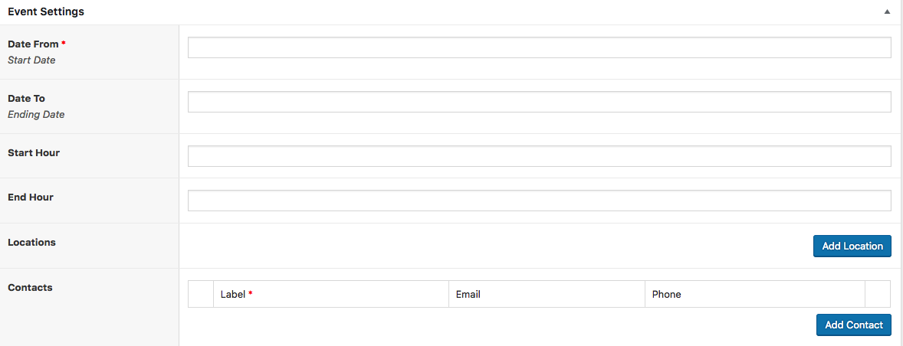
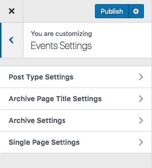

# Events
!> you need to install and activate the **Hilbert Theme Plugin** first.

## Add an Event
Adding a event is simple.
1. Admin Panel > Events menu > Add new
2. Enter the Name of the Event
3. You can build a page for it using the WP Editor or Page Builder.
4. Input the meta-data

 

> You can have multiple Locations and multiple Contacts for an Event

To add a location please verify that the address is recognizable by Google maps.

## Event Settings
All Events setting are available at :
> **Admin > Appearance > Customize**  Then **Events Setting**

There you can 
* Set archives page titles ( listing pages of your publications ).
* **Change Permalink** meaning that you can modify the URL of that page
* elements of the single page
* and you can modify the layout of your listing.

 

