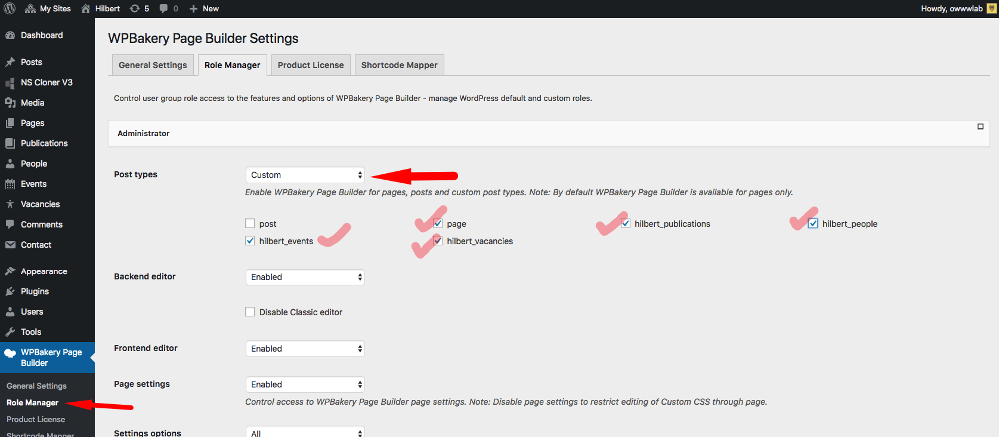
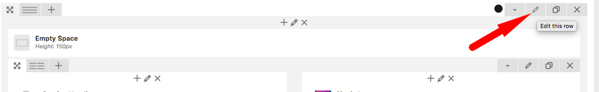
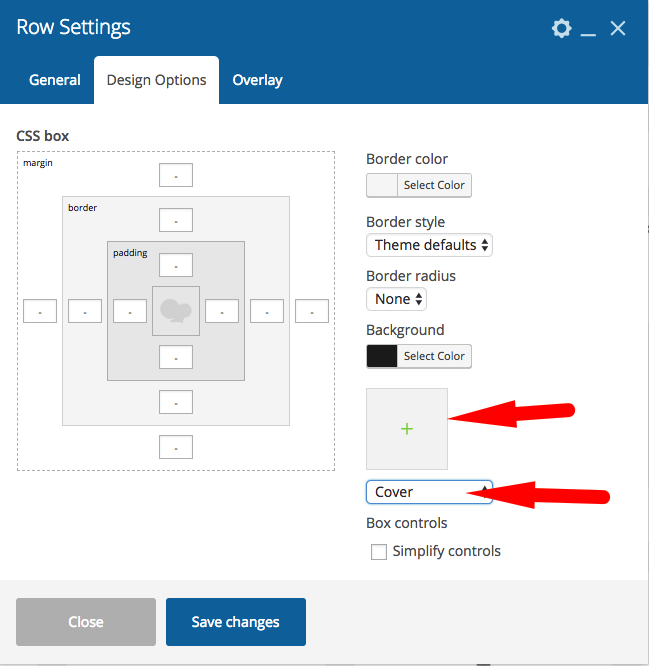

# FAQ

## Activate Visual Composer for Publications / Events etc.

As an administrator user, you should go to Visual Composer -&gt;**settings &gt; Role Management** and you can define which user groups can use the visual composer on which post types.

## Are you sure you want to do this? WordPress Error

!> This is not a theme issue or bug.

If you are installing Hilbert theme from the WordPress theme installer, but get a message that says _**Are you sure you want to do this?**_, most likely your web server is configured with a PHP settings that only allow a certain size ZIP file to be uploaded via WP admin.

Most hosting companies configure their servers to only have the maximum file upload size limit at 8-10 MB, some are less. If a file you want to upload is larger than that, then you will get that error!

**There are two ways to solve this problem.**

1. You can get your web host to increase your PHP limits so a larger zip file is allowed to be uploaded. They will know which limits to set if you explain the issue. Here are some recommended configurations:
  * `max_execution_time 60`
  * `memory_limit 128M`
  * `post_max_size 48M`
  * `upload_max_filesize 48M`
2. You can unzip theme zip file and upload the content directly to WordPress -&gt;wp-content-&gt;themes  theme via FTP and then go to dashboard-&gt;appearance-&gt;themes and activate Hilbert.

## How to add background image to a row?
As you may have noticed you can have a background image with overlay for a row. 

In a page click on the <mark>edit</mark> icon of the <mark>row</mark>

There you can add a background image and set it to cover the area. And for an overlay go to overlay tab and select one.

> Note: if you are using a dark background or a dark overlay, you can choose **light Text** at that tab to make texts lighter.

