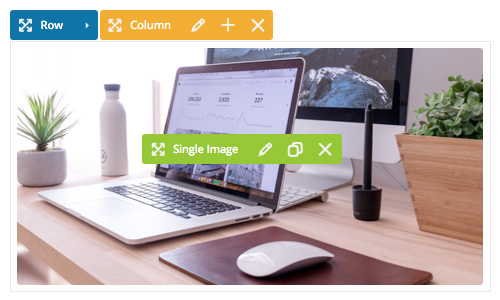
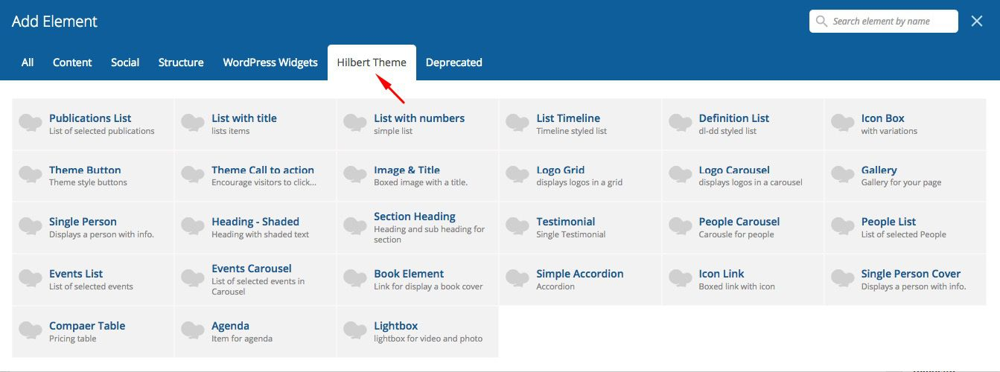
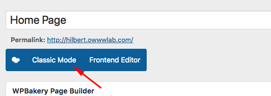
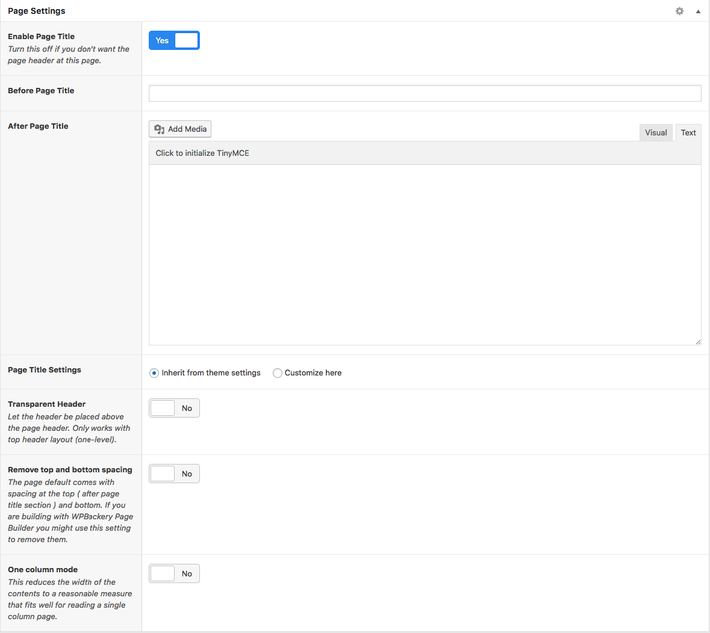
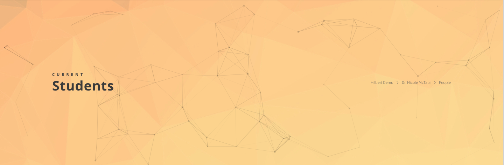
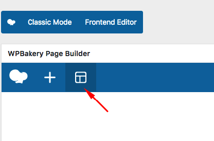
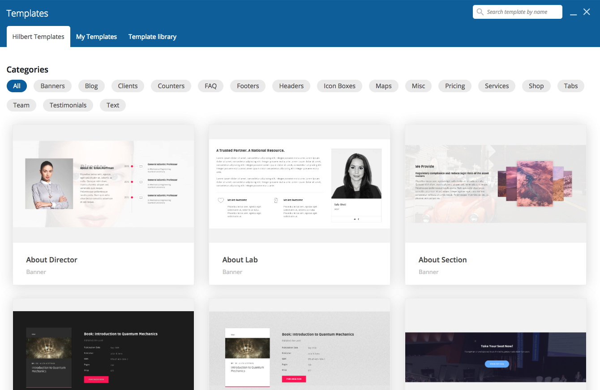

# Pages

## WPBackery Page Builder

Using WPBackery Page Builder plugin you can make more intuitive pages. You can find in depth video tutorials here: [https://wpbakery.com/video-tutorials/](https://wpbakery.com/video-tutorials/)

### What about a license?
WPBackery Page Builder plugin is bundled within the theme. That means you can use it for free but you can not get updates or support directly from the plugin author. So if you saw a "Activate your WPBackery Page Builder" message in future, just dismiss it and use our theme updates for updating the bundled plugins.

### Custom Elements
This theme adds a couple of handful elements to available elements of the page builder. Here is a list of names only for reference:

 

* **publications** : Displays a list of publications
* **list title** : Displays a list of elements
* **list numbers** : Displays a list with numbers
* **list time-line** : Displays a list with time-line
* **list definition** : Displays dd dt
* **icon-box** : Displays icon box
* **button** : Displays buttons with various options
* **call to action** : Displays call to action
* **image title** : Displays image with a link-able title
* **logo grid** : Displays logos in various grid sizes
* **logo carousel** : Displays logos in a carousel
* **gallery** : Displays images with description in a grid
* **person** : Displays a single person data
* **heading shaded** : Displays heading with a shaded label
* **section title** : Displays title for suitable for sections in a page
* **testimonial** : Displays single testimonial item
* **people carousel** : Displays a nice carousel for selected people
* **people** : Displays a list of people in a page
* **events** : Displays a list of events in a page
* **events carousel** : Displays a carousel of selected events in a page
* **book** : Displays a book item which is link-able
* **accordion** : Displays a simple accordion
* **icon link** : Displays a specific link box with an icon in a page
* **person cover** : Displays cover section for a person
* **compare table** : Displays a table which combined to other tables can be used as price tables
* **agenda** : Displays a full featured agenda in a page
* **single light-box** : Displays an image which on click grows and displays full screen.

## Default Editor
WordPress default editor is also a good option if you need a simple page with text and image only. 

### How to switch between them?
It is pretty simple. You just click the **Classic Mode** button to go to default editor and then on the **Backend Editor** to switch to page builder.

 

## Page Settings

 

For every page that you add, you can set the page title. This theme adds tow more spaces for the page title. 
1. Upper page title
2. short description of the page which will be displayed below the title.

Other page title settings are inherited from the theme options by default unless you want to make changes to this specific page. In that case you should check the **Customize here** option and set as you wish for the current page.

## Templates
There are many pre-built templates that can speed up your page building. While building a page using the WPBackery Page Builder. Click on templates icon: 

 

And then you can browse among many templates theme provides. Just click on the title of any to add that to the end of your page. Then you can customize it as you want.

