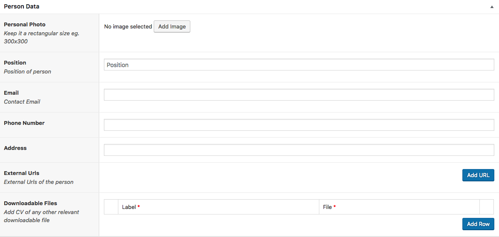
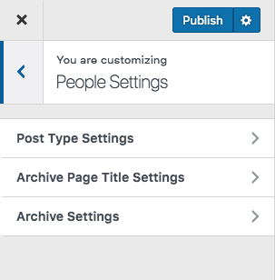
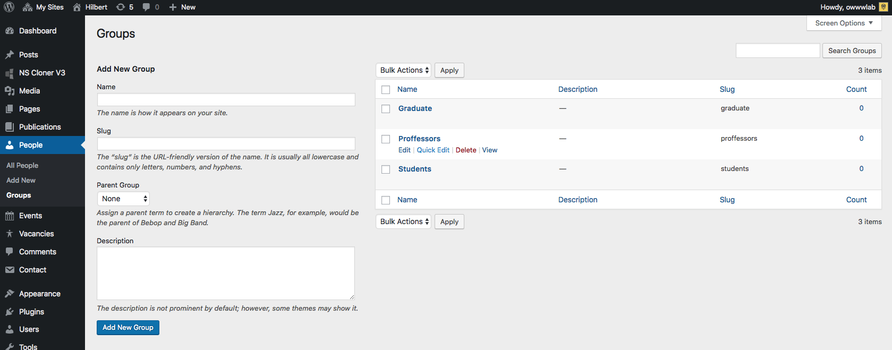

# People
!> you need to install and activate the **Hilbert Theme Plugin** first.

## Add a Person
Adding a new person is simple.
1. Admin Panel > People menu > Add new
2. Enter the Name of the person
3. You can build a page for it using the WP Editor or Page Builder.
4. Input the meta-data

 

> You can have multiple URLs and multiple files for a person

## People Settings
All Publication setting are available at :
> **Admin > Appearance > Customize**  Then **People Setting**

There you can 
* Set archives page titles ( listing pages of your publications ).
* **Change Permalink** meaning that you can modify the URL of that page
* and you can modify the layout of your listing.

 

## People Groups
You can make groups to categorize your people and assign each person to one or more groups.

 

## Manual Sorting
In the people settings > Post Type Archive, you can order your list by various measures. In case you want to sort them manually, you can install [Simple Custom Post Order](https://wordpress.org/plugins/simple-custom-post-order/) Plugin. Activate it and go to its settings and check the people post type. At the Admin panel click on People menu and then drag and drop items to manually order them.
