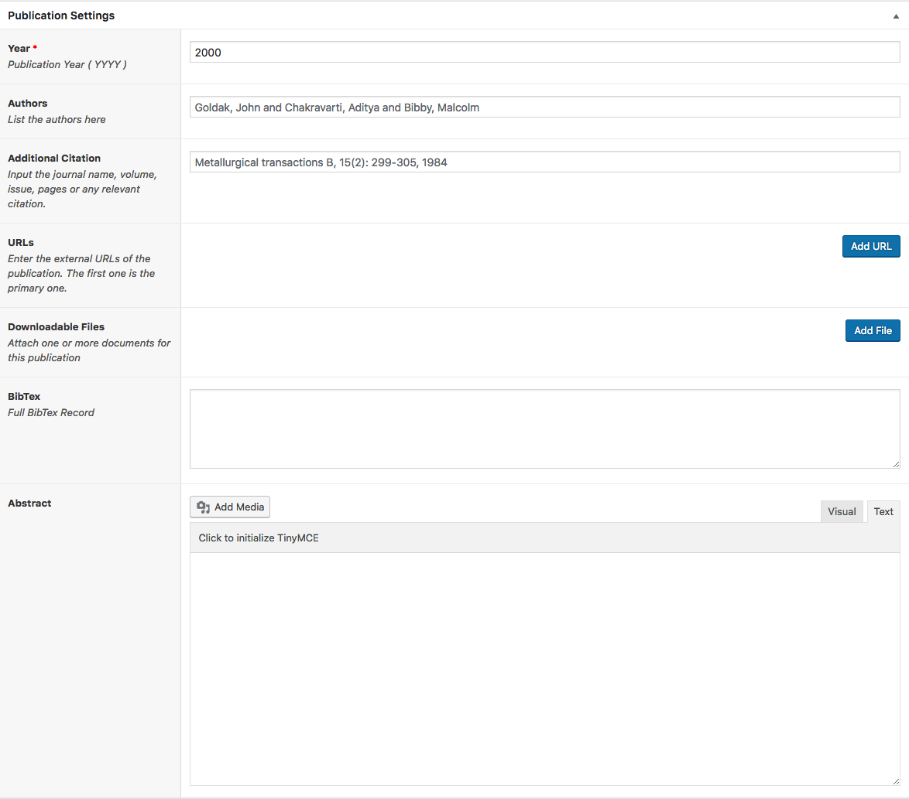
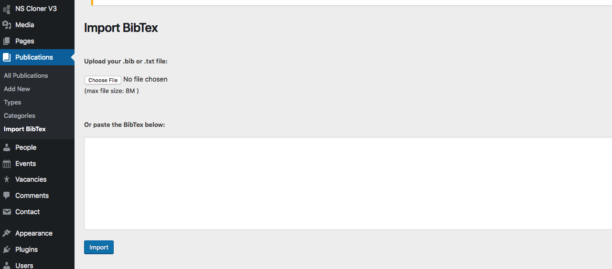
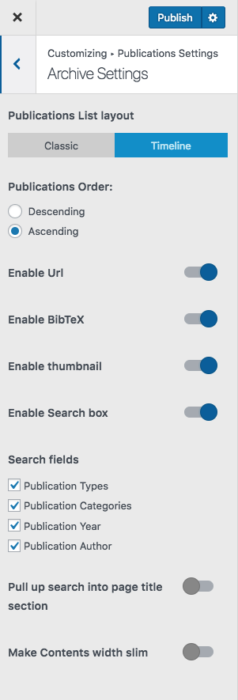
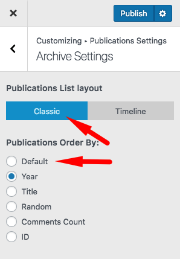

# Publications

!> you need to install and activate the **Hilbert Theme Plugin** first.

## Add a Publication
Adding a publication is simple.
1. Admin Panel > Publications menu > Add new
2. Enter the title of the publication
3. You can build a page for it using the WP Editor or Page Builder.
4. Input the meta-data

 

!> You can have multiple links and multiple files for a publication

## Import Publications
In order to import your publications, you can export a BibTex file from your citation manager software and directly import it. 

> Go to Admin > Publications menus > Import BibTex

There you have tow options.
1. Copy / Paste the BibTex 
2. Upload the file containing BibTex

After the import is finished, you can go to each imported item and complete the meta-data and other information.

 

## Publication Settings
All Publication setting are available at :
> **Admin > Appearance > Customize**  Then **Publications Setting**

There you can 
* Set archives page titles ( listing pages of your publications ).
* **Change Permalink** meaning that you can modify the URL of that page
* and you can modify the layout of your listing.

 

## Publication Types
When you install the theme and plugin, it populates some default publication types for you. You add and edit them. Use this types to organize your publications.

## Publication Categories
Also you can categorize your publications further by categories. 

## Manual Order
In the Publication settings > Post Type Archive, you can order your publications by various measures. In case you want to sort them manually, you can install [Simple Custom Post Order](https://wordpress.org/plugins/simple-custom-post-order/) Plugin. Activate it and go to its settings and check the publications. 
* Let the **Publications List layout** to Classic mode
* **Publications Order By:** > default
* and then drag and drop your publication in admin panel to manually order them.

 
