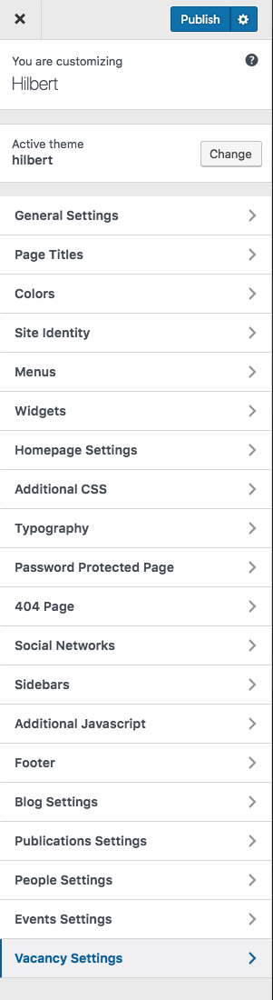

# Theme options

All options and customizations offered by the theme are available at WordPress Customizer which is placed at <mark>_Dashboard > Appearance > Customize_</mark> menu.

 

It is pretty simple since it shows the changes immediately.

## How to add Logo?
Go to **Site Identity** and there you have tow options

1. if you want to add you avatar as a logo select the **Avatar Logo** and upload a rectangular ( e.g. 100px by 100px ) photo with your face at the center and another one for retina displays which should be twice bigger.

2. Normal logo. The theme detects if you have a dark background for the header or light that is why you should upload a dark and a light version of your logo.
