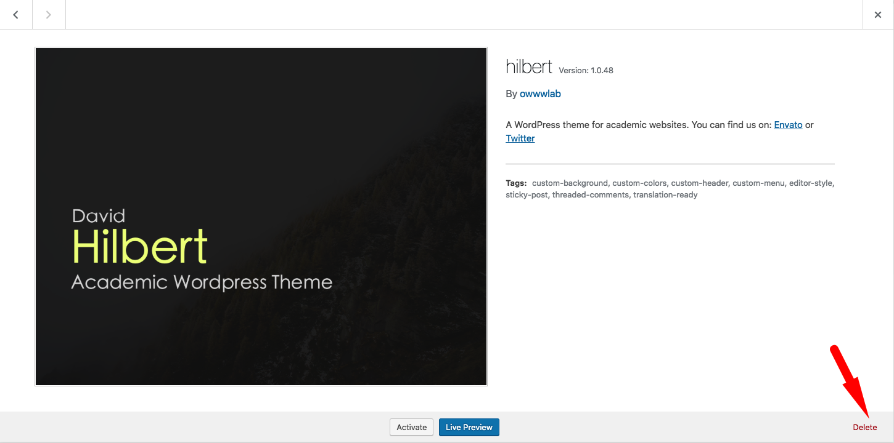

# Updating Theme

## How to get notified about updates?
Each time that we release a new update, an email notification will be send to customers that are in notifying list.

Please go to your [Themeforest account download page](http://themeforest.net/downloads)  and make sure the “Get notified by email if this item is updated” is selected for Hilbert theme.

## Updating theme using Envato Market plugin
If you have installed and activated the Envato Market plugin you can update your theme directly from Envato server.

When the plugin is activated you should see ”Envato Market” in your admin panel menu. If it is not there then you need to install and activate.

After activating the plugin, you need to know your ThemeForest username and API key to set up the connection.

Upon successful settings you will get notified right from your admin panel if a new update is released and then you can update your theme with one click.

## Updating theme and plugins from WordPress admin panel

You can update the theme using “Envato Market" but still you will need to updates packaged plugins manually.

The latest version of theme and plugins are always available in your Themeforest account download page. You need to re-download the package and unzip it somewhere on your computer.

After unzipping the package you can find the latest version of theme but before updating you must deactivate and delete the old verison of theme.

In order to do that please go to your _admin panel -> appearance-> Themes_ and activate any other available theme other than Hilbert (Twenty Fourteen for example) and then click on Hilbert theme details.

As you can see in following figure, there is a delete link at the right bottom corner of pop up:

!> Don't worry! you won't loose any data. 

OK! now we need to install the latest version.

### Updating plugins:
We have some plugins in the theme, that might need updating as well. After installing the new version of theme you will a notification in admin panel about the plugins which needs updating.

If updating fails for some reason, you can always disable and delete the plugin and then install it again.

## Updating theme using FTP
This one is little advanced, if you do have access to your server FTP you can overwrite the theme and plugins files directly.

For uploading theme, unzip the theme file and upload the **hilbert folder** to following address on your server:

> WordPress root-> wp-content-> themes

## Do I need to worry about my website contents?
Generally No, update does not effects contents unless we mention it in update section of documentation but it is recommend that you get a backup before starting the procedure.
