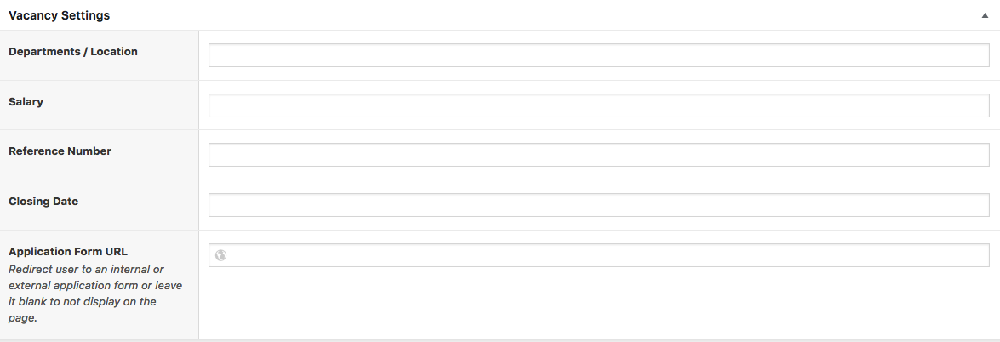
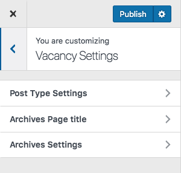

# Vacancies
!> you need to install and activate the **Hilbert Theme Plugin** first.

## Add a Vacancy
Adding a vacancy is simple.
1. Admin Panel > Vacancies menu > Add new
2. Enter the Name of the Vacancy
3. You can build a page for it using the WP Editor or Page Builder.
4. Input the meta-data

 

## Vacancy Settings
All Events setting are available at :
> **Admin > Appearance > Customize**  Then **Vacancy Setting**

There you can 
* Set archives page titles ( listing pages ).
* **Change Permalink** meaning that you can modify the URL of that page
* and you can modify the layout of your listing.

 